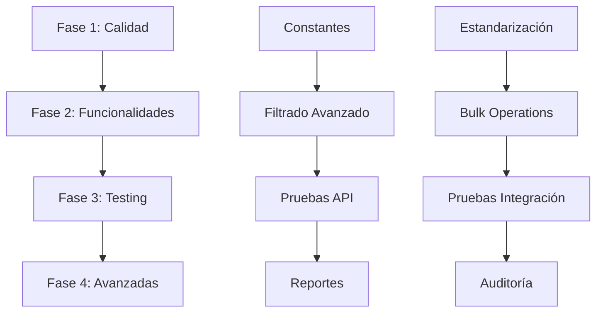

# Plan de Implementación Detallado - Item Substitution API

## Índice
- [Resumen Ejecutivo](#resumen-ejecutivo)
- [Fase 1: Calidad del Código y Consistencia](#fase-1-calidad-del-código-y-consistencia)
- [Fase 2: Mejoras de Funcionalidad](#fase-2-mejoras-de-funcionalidad)
- [Fase 3: Testing y Aseguramiento de Calidad](#fase-3-testing-y-aseguramiento-de-calidad)
- [Fase 4: Funcionalidades Avanzadas](#fase-4-funcionalidades-avanzadas)
- [Dependencias y Prerequisites](#dependencias-y-prerequisites)
- [Evaluación de Riesgos](#evaluación-de-riesgos)
- [Métricas de Éxito](#métricas-de-éxito)

---

## Resumen Ejecutivo

Este plan de implementación está diseñado para mejorar la extensión Item Substitution API de Business Central manteniendo su arquitectura de alta calidad existente. El plan se estructura en 4 fases progresivas que abordan calidad del código, funcionalidades, testing y características avanzadas.

**Duración Total Estimada:** 11-15 semanas
**Recursos Requeridos:** 1-2 desarrolladores AL
**Complejidad:** Media-Alta
**Riesgo General:** Bajo-Medio

---

## Fase 1: Calidad del Código y Consistencia
**Duración:** 2-3 semanas | **Complejidad:** Media | **Riesgo:** Bajo

### 1.1 Estandarización de Idioma
**Problema Identificado:** Mezcla de inglés y español en mensajes de error

**Archivos a Modificar:**
- `src/codeunits/Codeunit50202_SubstituteManagement.al`

**Cambios Específicos:**
```al
// ANTES (líneas 8, 10, 12, 14):
Error('No se puede crear un sustituto circular');

// DESPUÉS:
Error('Cannot create circular substitution');
```

**Tareas Detalladas:**
1. **Auditoría de mensajes** (2 horas)
   - Identificar todos los mensajes user-facing
   - Crear inventario de textos mixtos
   
2. **Estandarización** (4 horas)
   - Convertir mensajes españoles a inglés
   - Mantener claridad y contexto técnico
   
3. **Infraestructura multiidioma** (8 horas - Opcional)
   - Crear sistema de labels para internacionalización
   - Preparar para soporte multi-lenguaje futuro

**Criterios de Éxito:**
- ✅ Cero mensajes en español en código
- ✅ Consistencia en terminología técnica
- ✅ Documentación API actualizada

### 1.2 Implementación de Constantes
**Problema Identificado:** Valores hard-coded (rangos de prioridad 1-10, números mágicos)

**Implementación Técnica:**
```al
// Nuevo archivo: src/enums/Enum50200_SubstituteStatus.al
enum 50200 "Substitute Status"
{
    Extensible = true;
    
    value(0; Active) 
    { 
        Caption = 'Active';
    }
    value(1; Expired) 
    { 
        Caption = 'Expired';
    }
    value(2; Pending) 
    { 
        Caption = 'Pending';
    }
}

// Nuevo archivo: src/codeunits/Codeunit50205_SubstituteConstants.al
codeunit 50205 "Substitute Constants"
{
    var
        MIN_PRIORITY_VALUE: Integer;
        MAX_PRIORITY_VALUE: Integer;
        DEFAULT_PRIORITY_VALUE: Integer;
        JSON_SUCCESS_FIELD: Text;
        JSON_ERROR_FIELD: Text;
        JSON_DATA_FIELD: Text;
        
    procedure GetMinPriority(): Integer
    begin
        exit(1);
    end;
    
    procedure GetMaxPriority(): Integer
    begin
        exit(10);
    end;
    
    procedure GetDefaultPriority(): Integer
    begin
        exit(5);
    end;
    
    procedure GetJsonFieldNames(): Text
    begin
        exit('{"success":"success","error":"error","data":"data"}');
    end;
}
```

**Refactoring en Archivos Existentes:**
```al
// En Codeunit50204_ItemSubstituteMCPTool.al
// ANTES:
if Priority < 1 then
    Priority := 5;

// DESPUÉS:
SubstituteConstants: Codeunit "Substitute Constants";
if Priority < SubstituteConstants.GetMinPriority() then
    Priority := SubstituteConstants.GetDefaultPriority();
```

**Tareas Detalladas:**
1. **Crear codeunit de constantes** (4 horas)
2. **Refactorizar valores hard-coded** (6 horas)
3. **Implementar enum de estados** (3 horas)
4. **Testing de regresión** (3 horas)

**Criterios de Éxito:**
- ✅ Cero números mágicos en código de negocio
- ✅ Enum utilizado consistentemente
- ✅ Facilidad de configuración mejorada

### 1.3 Manejo Mejorado de Errores
**Objetivo:** Respuestas de error estructuradas con códigos para manejo programático

**Nueva Estructura de Error:**
```al
// src/tables/Table50204_ErrorResponse.al
table 50204 "Error Response Buffer"
{
    TableType = Temporary;
    
    fields
    {
        field(1; "Error Code"; Code[20]) { }
        field(2; "Error Message"; Text[250]) { }
        field(3; "Field Name"; Text[50]) { }
        field(4; "Severity Level"; Option) 
        { 
            OptionMembers = Info,Warning,Error,Critical;
        }
        field(5; "Additional Context"; Blob) { }
    }
}

// Implementación en Codeunit50204:
local procedure CreateErrorResponse(ErrorCode: Code[20]; ErrorMessage: Text): Text
var
    ErrorJson: JsonObject;
    ErrorArray: JsonArray;
    ErrorDetail: JsonObject;
begin
    ErrorDetail.Add('code', ErrorCode);
    ErrorDetail.Add('message', ErrorMessage);
    ErrorDetail.Add('timestamp', CurrentDateTime);
    
    ErrorArray.Add(ErrorDetail);
    ErrorJson.Add('success', false);
    ErrorJson.Add('errors', ErrorArray);
    
    exit(Format(ErrorJson));
end;
```

**Códigos de Error Específicos:**
- `CIRCULAR_DEP`: Dependencia circular detectada
- `INVALID_DATE`: Fechas inválidas
- `PRIORITY_RANGE`: Prioridad fuera de rango
- `ITEM_NOT_FOUND`: Artículo no encontrado
- `VALIDATION_FAILED`: Validación general fallida

**Criterios de Éxito:**
- ✅ Respuestas JSON estructuradas consistentemente
- ✅ Códigos de error para manejo programático
- ✅ Logging mejorado para debugging

---

## Fase 2: Mejoras de Funcionalidad
**Duración:** 3-4 semanas | **Complejidad:** Alta | **Riesgo:** Medio

### 2.1 Implementación de Ordenamiento por Prioridad
**Problema Identificado:** Clave de prioridad comentada por dependencias de símbolos

**Archivo Principal:** `src/tables/TableExt50200_ItemSubstitution.al`

**Implementación Técnica:**
```al
tableextension 50200 ItemSubstitutionExt extends "Item Substitution"
{
    fields
    {
        // Campos existentes...
        
        field(50205; Priority; Integer)
        {
            Caption = 'Priority';
            InitValue = 5;
            
            trigger OnValidate()
            var
                SubstituteConstants: Codeunit "Substitute Constants";
            begin
                if (Priority < SubstituteConstants.GetMinPriority()) or 
                   (Priority > SubstituteConstants.GetMaxPriority()) then
                    Error('Priority must be between %1 and %2', 
                          SubstituteConstants.GetMinPriority(), 
                          SubstituteConstants.GetMaxPriority());
            end;
        }
    }
    
    keys
    {
        // Descomenta y prueba la siguiente clave:
        addlast(PriorityKey; "Item No.", Priority) { }
    }
}
```

**Plan de Resolución de Dependencias:**
1. **Descargar símbolos actualizados** (1 día)
   - Verificar compatibilidad con BC 26.0
   - Probar compilación en entorno de desarrollo
   
2. **Testing incremental de clave** (2 días)
   - Compilar solo la extensión de tabla
   - Verificar rendimiento de consultas
   - Probar con datos de prueba
   
3. **Actualización de APIs** (3 días)
   - Modificar endpoints para utilizar ordenamiento por prioridad
   - Actualizar procedimientos de consulta

**Criterios de Éxito:**
- ✅ Clave de prioridad compila sin errores
- ✅ APIs devuelven resultados ordenados por prioridad
- ✅ Rendimiento de consultas < 200ms para conjuntos típicos

### 2.2 Capacidades de Filtrado Avanzado
**Objetivo:** Filtros flexibles para consultas complejas de sustitutos

**Nueva API Endpoint:**
```al
// src/pages/Page50213_AdvancedSubstituteAPI.al
page 50213 "Advanced Substitute Filter API"
{
    PageType = API;
    APIPublisher = 'Company';
    APIGroup = 'ItemSubstitution';
    APIVersion = 'v1.1';
    EntityName = 'advancedSubstitute';
    EntitySetName = 'advancedSubstitutes';
    SourceTable = "Item Substitute Chain Buffer";
    
    layout
    {
        area(content)
        {
            repeater(Group)
            {
                field(itemNo; "Item No.") { }
                field(substituteNo; "Substitute No.") { }
                field(priority; Priority) { }
                field(effectiveDate; "Effective Date") { }
                field(expiryDate; "Expiry Date") { }
                field(notes; Notes) { }
                field(createdBy; "Created By") { }
                field(isActive; IsActive) { }
            }
        }
    }
    
    [ServiceEnabled]
    procedure GetFilteredSubstitutes(ItemNo: Code[20]; 
                                   MinPriority: Integer; 
                                   MaxPriority: Integer; 
                                   EffectiveDateFrom: Date; 
                                   EffectiveDateTo: Date;
                                   OnlyActive: Boolean): Text
    var
        SubstituteMgt: Codeunit "Substitute Management";
        FilteredResults: Text;
    begin
        FilteredResults := SubstituteMgt.GetFilteredSubstitutes(
            ItemNo, MinPriority, MaxPriority, 
            EffectiveDateFrom, EffectiveDateTo, OnlyActive);
        exit(FilteredResults);
    end;
}
```

**Implementación en Business Logic:**
```al
// Extensión del Codeunit50202_SubstituteManagement.al
procedure GetFilteredSubstitutes(ItemNo: Code[20]; 
                               MinPriority: Integer; 
                               MaxPriority: Integer; 
                               DateFrom: Date; 
                               DateTo: Date; 
                               OnlyActive: Boolean): Text
var
    ItemSubstitution: Record "Item Substitution";
    ResultJson: JsonObject;
    DataArray: JsonArray;
    ItemJson: JsonObject;
begin
    // Aplicar filtros
    ItemSubstitution.SetRange("Item No.", ItemNo);
    
    if MinPriority > 0 then
        ItemSubstitution.SetFilter(Priority, '>=%1', MinPriority);
        
    if MaxPriority > 0 then
        ItemSubstitution.SetFilter(Priority, '<=%1', MaxPriority);
        
    if DateFrom <> 0D then
        ItemSubstitution.SetFilter("Effective Date", '>=%1', DateFrom);
        
    if DateTo <> 0D then
        ItemSubstitution.SetFilter("Expiry Date", '<=%1|%2', DateTo, 0D);
        
    if OnlyActive then
        ItemSubstitution.SetFilter("Expiry Date", '%1|>%2', 0D, Today);
    
    // Construir respuesta JSON
    ItemSubstitution.SetCurrentKey("Item No.", Priority);
    
    if ItemSubstitution.FindSet() then
        repeat
            Clear(ItemJson);
            ItemJson.Add('itemNo', ItemSubstitution."Item No.");
            ItemJson.Add('substituteNo', ItemSubstitution."Substitute No.");
            ItemJson.Add('priority', ItemSubstitution.Priority);
            ItemJson.Add('effectiveDate', ItemSubstitution."Effective Date");
            ItemJson.Add('expiryDate', ItemSubstitution."Expiry Date");
            ItemJson.Add('notes', ItemSubstitution.Notes);
            DataArray.Add(ItemJson);
        until ItemSubstitution.Next() = 0;
    
    ResultJson.Add('success', true);
    ResultJson.Add('data', DataArray);
    ResultJson.Add('count', DataArray.Count);
    
    exit(Format(ResultJson));
end;
```

### 2.3 Soporte para Operaciones en Lote
**Objetivo:** Creación/desactivación masiva manteniendo integridad de datos

**Nueva API para Bulk Operations:**
```al
// src/pages/Page50214_BulkSubstituteAPI.al
page 50214 "Bulk Substitute Operations API"
{
    PageType = API;
    APIPublisher = 'Company';
    APIGroup = 'ItemSubstitution';
    APIVersion = 'v1.1';
    EntityName = 'bulkSubstituteOperation';
    EntitySetName = 'bulkSubstituteOperations';
    SourceTable = "Item Substitute Chain Buffer";
    
    [ServiceEnabled]
    procedure BulkCreateSubstitutes(RequestJson: Text): Text
    var
        BulkProcessor: Codeunit "Bulk Substitute Processor";
    begin
        exit(BulkProcessor.ProcessBulkCreate(RequestJson));
    end;
    
    [ServiceEnabled]
    procedure BulkDeactivateSubstitutes(RequestJson: Text): Text
    var
        BulkProcessor: Codeunit "Bulk Substitute Processor";
    begin
        exit(BulkProcessor.ProcessBulkDeactivate(RequestJson));
    end;
}
```

**Nuevo Codeunit para Procesamiento en Lote:**
```al
// src/codeunits/Codeunit50206_BulkSubstituteProcessor.al
codeunit 50206 "Bulk Substitute Processor"
{
    procedure ProcessBulkCreate(RequestJson: Text): Text
    var
        RequestObject: JsonObject;
        ItemsArray: JsonArray;
        ItemToken: JsonToken;
        ItemObject: JsonObject;
        Results: JsonArray;
        ResponseObject: JsonObject;
        SuccessCount: Integer;
        ErrorCount: Integer;
        Database: Database;
        SubstituteMgt: Codeunit "Substitute Management";
    begin
        // Parsear JSON request
        if not RequestObject.ReadFrom(RequestJson) then
            exit(CreateErrorResponse('INVALID_JSON', 'Invalid JSON format'));
            
        if not RequestObject.Get('items', ItemToken) then
            exit(CreateErrorResponse('MISSING_ITEMS', 'Items array required'));
            
        ItemsArray := ItemToken.AsArray();
        
        // Iniciar transacción
        Database.StartTransaction();
        
        try
            // Procesar cada elemento
            foreach ItemToken in ItemsArray do begin
                ItemObject := ItemToken.AsObject();
                if ProcessSingleSubstitute(ItemObject, Results) then
                    SuccessCount += 1
                else
                    ErrorCount += 1;
            end;
            
            // Commit si todo salió bien
            if ErrorCount = 0 then begin
                Database.Commit();
                ResponseObject.Add('success', true);
            end else begin
                Database.Rollback();
                ResponseObject.Add('success', false);
            end;
            
        except
            Database.Rollback();
            ResponseObject.Add('success', false);
            ResponseObject.Add('error', 'Transaction failed');
        end;
        
        ResponseObject.Add('processed', SuccessCount + ErrorCount);
        ResponseObject.Add('successful', SuccessCount);
        ResponseObject.Add('errors', ErrorCount);
        ResponseObject.Add('results', Results);
        
        exit(Format(ResponseObject));
    end;
    
    local procedure ProcessSingleSubstitute(ItemJson: JsonObject; var Results: JsonArray): Boolean
    var
        ItemNo: Code[20];
        SubstituteNo: Code[20];
        Priority: Integer;
        EffectiveDate: Date;
        ExpiryDate: Date;
        Notes: Text[250];
        ResultItem: JsonObject;
        SubstituteMgt: Codeunit "Substitute Management";
        CreateResult: Text;
    begin
        // Extraer datos del JSON
        if not GetJsonValue(ItemJson, 'itemNo', ItemNo) then begin
            AddErrorResult(Results, '', '', 'Missing itemNo');
            exit(false);
        end;
        
        if not GetJsonValue(ItemJson, 'substituteNo', SubstituteNo) then begin
            AddErrorResult(Results, ItemNo, '', 'Missing substituteNo');
            exit(false);
        end;
        
        GetJsonValue(ItemJson, 'priority', Priority);
        GetJsonValue(ItemJson, 'effectiveDate', EffectiveDate);
        GetJsonValue(ItemJson, 'expiryDate', ExpiryDate);
        GetJsonValue(ItemJson, 'notes', Notes);
        
        // Validar dependencia circular ANTES de crear
        if SubstituteMgt.WouldCreateCircularDependency(ItemNo, SubstituteNo) then begin
            AddErrorResult(Results, ItemNo, SubstituteNo, 'Would create circular dependency');
            exit(false);
        end;
        
        // Crear sustituto
        CreateResult := SubstituteMgt.CreateItemSubstitute(
            ItemNo, SubstituteNo, Priority, EffectiveDate, ExpiryDate, Notes);
            
        // Procesar resultado
        if StrPos(CreateResult, '"success":true') > 0 then begin
            AddSuccessResult(Results, ItemNo, SubstituteNo);
            exit(true);
        end else begin
            AddErrorResult(Results, ItemNo, SubstituteNo, 'Creation failed');
            exit(false);
        end;
    end;
}
```

**Criterios de Éxito:**
- ✅ Transacciones atómicas (todo o nada)
- ✅ Validación de dependencias circulares mantenida
- ✅ Manejo elegante de fallos parciales
- ✅ Rendimiento < 5 segundos para 100 elementos

---

## Fase 3: Testing y Aseguramiento de Calidad
**Duración:** 2-3 semanas | **Complejidad:** Media | **Riesgo:** Bajo

### 3.1 Suite Expandida de Pruebas Unitarias
**Estado Actual:** Solo 3 procedimientos de prueba en `Codeunit50240_SubstituteTests.al`

**Nuevos Test Cases Requeridos:**

```al
// Extensión del archivo de pruebas existente
codeunit 50240 "Substitute Tests"
{
    // Pruebas existentes...
    
    [Test] 
    procedure CircularDetection_DeepChain()
    var
        SubstituteMgt: Codeunit "Substitute Management";
        ItemSubstitution: Record "Item Substitution";
    begin
        // Preparar: A → B → C → D → A
        CreateTestSubstitute('A', 'B');
        CreateTestSubstitute('B', 'C');
        CreateTestSubstitute('C', 'D');
        
        // Actuar y Verificar
        asserterror SubstituteMgt.CreateItemSubstitute('D', 'A', 1, 0D, 0D, '');
        Assert.ExpectedError('circular');
    end;
    
    [Test]
    procedure CircularDetection_SelfReference()
    var
        SubstituteMgt: Codeunit "Substitute Management";
    begin
        // Actuar y Verificar
        asserterror SubstituteMgt.CreateItemSubstitute('ITEM1', 'ITEM1', 1, 0D, 0D, '');
        Assert.ExpectedError('mismo artículo');
    end;
    
    [Test]
    procedure ValidationTest_PriorityBoundaries()
    var
        SubstituteMgt: Codeunit "Substitute Management";
    begin
        // Probar prioridad inválida (0)
        asserterror SubstituteMgt.CreateItemSubstitute('A', 'B', 0, 0D, 0D, '');
        
        // Probar prioridad inválida (11)
        asserterror SubstituteMgt.CreateItemSubstitute('A', 'B', 11, 0D, 0D, '');
        
        // Probar prioridades válidas
        Assert.IsTrue(SubstituteMgt.CreateItemSubstitute('A', 'B', 1, 0D, 0D, '') <> '', 'Min priority failed');
        Assert.IsTrue(SubstituteMgt.CreateItemSubstitute('C', 'D', 10, 0D, 0D, '') <> '', 'Max priority failed');
    end;
    
    [Test]
    procedure ValidationTest_DateLogic()
    var
        SubstituteMgt: Codeunit "Substitute Management";
    begin
        // Fecha efectiva futura con fecha de expiración pasada
        asserterror SubstituteMgt.CreateItemSubstitute('A', 'B', 5, CalcDate('+1D', Today), CalcDate('-1D', Today), '');
        
        // Fechas válidas
        Assert.IsTrue(SubstituteMgt.CreateItemSubstitute('C', 'D', 5, Today, CalcDate('+30D', Today), '') <> '', 'Valid dates failed');
    end;
    
    [Test]
    procedure BulkOperations_TransactionIntegrity()
    var
        BulkProcessor: Codeunit "Bulk Substitute Processor";
        RequestJson: Text;
        ResponseText: Text;
        ResponseObject: JsonObject;
        SuccessToken: JsonToken;
    begin
        // Preparar JSON con elementos válidos e inválidos mezclados
        RequestJson := '{"items":[' +
                      '{"itemNo":"A","substituteNo":"B","priority":5},' +
                      '{"itemNo":"B","substituteNo":"A","priority":5},' + // Creará circular
                      '{"itemNo":"C","substituteNo":"D","priority":5}' +
                      ']}';
        
        // Actuar
        ResponseText := BulkProcessor.ProcessBulkCreate(RequestJson);
        
        // Verificar que falló completamente (transacción atómica)
        ResponseObject.ReadFrom(ResponseText);
        ResponseObject.Get('success', SuccessToken);
        Assert.IsFalse(SuccessToken.AsValue().AsBoolean(), 'Transaction should have failed completely');
        
        // Verificar que no se crearon registros
        VerifySubstituteNotExists('A', 'B');
        VerifySubstituteNotExists('C', 'D');
    end;
    
    [Test]
    procedure PerformanceTest_LargeSubstituteChain()
    var
        SubstituteMgt: Codeunit "Substitute Management";
        StartTime: DateTime;
        EndTime: DateTime;
        ElapsedMs: Integer;
        i: Integer;
    begin
        // Crear cadena larga (100 elementos)
        for i := 1 to 99 do
            CreateTestSubstitute('ITEM' + Format(i), 'ITEM' + Format(i + 1));
        
        StartTime := CurrentDateTime;
        
        // Probar detección circular en cadena larga
        asserterror SubstituteMgt.CreateItemSubstitute('ITEM100', 'ITEM1', 1, 0D, 0D, '');
        
        EndTime := CurrentDateTime;
        ElapsedMs := EndTime - StartTime;
        
        Assert.IsTrue(ElapsedMs < 500, 'Performance requirement not met: ' + Format(ElapsedMs) + 'ms');
    end;
    
    [Test]
    procedure FilteredQuery_ComplexScenarios()
    var
        SubstituteMgt: Codeunit "Substitute Management";
        ResultJson: Text;
        ResultObject: JsonObject;
        DataArray: JsonArray;
        DataToken: JsonToken;
    begin
        // Preparar datos de prueba con diferentes prioridades y fechas
        CreateTestSubstitute('MAIN', 'SUB1', 1, Today, CalcDate('+30D', Today));
        CreateTestSubstitute('MAIN', 'SUB2', 5, Today, 0D);
        CreateTestSubstitute('MAIN', 'SUB3', 10, CalcDate('-10D', Today), CalcDate('-1D', Today)); // Expirado
        
        // Probar filtro solo activos
        ResultJson := SubstituteMgt.GetFilteredSubstitutes('MAIN', 0, 0, 0D, 0D, true);
        
        ResultObject.ReadFrom(ResultJson);
        ResultObject.Get('data', DataToken);
        DataArray := DataToken.AsArray();
        
        Assert.AreEqual(2, DataArray.Count(), 'Should return only active substitutes');
    end;
    
    local procedure CreateTestSubstitute(ItemNo: Code[20]; SubstituteNo: Code[20])
    begin
        CreateTestSubstitute(ItemNo, SubstituteNo, 5, 0D, 0D);
    end;
    
    local procedure CreateTestSubstitute(ItemNo: Code[20]; SubstituteNo: Code[20]; Priority: Integer; EffectiveDate: Date; ExpiryDate: Date)
    var
        ItemSubstitution: Record "Item Substitution";
    begin
        if ItemSubstitution.Get(ItemNo, '', SubstituteNo) then
            ItemSubstitution.Delete();
            
        ItemSubstitution.Init();
        ItemSubstitution."Item No." := ItemNo;
        ItemSubstitution."Substitute No." := SubstituteNo;
        ItemSubstitution.Priority := Priority;
        ItemSubstitution."Effective Date" := EffectiveDate;
        ItemSubstitution."Expiry Date" := ExpiryDate;
        ItemSubstitution.Insert();
    end;
    
    local procedure VerifySubstituteNotExists(ItemNo: Code[20]; SubstituteNo: Code[20])
    var
        ItemSubstitution: Record "Item Substitution";
    begin
        Assert.IsFalse(ItemSubstitution.Get(ItemNo, '', SubstituteNo), 
                      'Substitute should not exist: ' + ItemNo + '->' + SubstituteNo);
    end;
}
```

**Criterios de Éxito:**
- ✅ Cobertura de código > 90%
- ✅ Todos los casos edge cubiertos
- ✅ Pruebas de rendimiento establecidas
- ✅ Validación de integridad transaccional

### 3.2 Pruebas de Integración de API
**Objetivo:** Verificar comportamiento end-to-end de todos los endpoints

**Framework de Pruebas API:**
```al
// src/test/Codeunit50241_APIIntegrationTests.al
codeunit 50241 "API Integration Tests"
{
    Subtype = Test;
    
    [Test]
    procedure ActionsAPI_CreateSubstitute_ValidData()
    var
        TestRequestJson: Text;
        ResponseText: Text;
        ResponseObject: JsonObject;
        SuccessToken: JsonToken;
    begin
        TestRequestJson := '{"itemNo":"TEST1","substituteNo":"TEST2","priority":5}';
        
        // Simular llamada API
        ResponseText := CallActionsAPI('CreateItemSubstitute', TestRequestJson);
        
        // Verificar respuesta
        ResponseObject.ReadFrom(ResponseText);
        ResponseObject.Get('success', SuccessToken);
        Assert.IsTrue(SuccessToken.AsValue().AsBoolean(), 'API call should succeed');
        
        // Verificar que el registro se creó
        VerifySubstituteExists('TEST1', 'TEST2');
    end;
    
    [Test]
    procedure ODataAPI_CRUD_Operations()
    var
        TestData: JsonObject;
        ResponseText: Text;
    begin
        // POST - Crear
        TestData.Add('Item_No', 'ODATA1');
        TestData.Add('Substitute_No', 'ODATA2');
        TestData.Add('Priority', 7);
        
        ResponseText := CallODataAPI('POST', Format(TestData));
        VerifyODataSuccess(ResponseText);
        
        // GET - Leer
        ResponseText := CallODataAPI('GET', '');
        VerifyODataResponse(ResponseText, 'ODATA1', 'ODATA2');
        
        // PATCH - Actualizar
        TestData.Add('Priority', 3);
        ResponseText := CallODataAPI('PATCH', Format(TestData));
        VerifyODataSuccess(ResponseText);
        
        // DELETE - Eliminar (soft delete)
        ResponseText := CallODataAPI('DELETE', '');
        VerifyODataSuccess(ResponseText);
    end;
}
```

### 3.3 Pruebas de Rendimiento y Carga
**Objetivo:** Establecer benchmarks y identificar cuellos de botella

**Métricas Target:**
- Detección de dependencia circular: < 500ms para cadenas de 1000 elementos
- Respuesta API: < 200ms para consultas típicas
- Uso de memoria: < 50MB para redes de sustitutos complejas
- Operaciones bulk: < 5 segundos para 100 elementos

---

## Fase 4: Funcionalidades Avanzadas
**Duración:** 4-5 semanas | **Complejidad:** Alta | **Riesgo:** Medio

### 4.1 Sistema de Auditoría Avanzado
**Objetivo:** Historial completo de modificaciones con capacidad de rollback

**Nueva Tabla de Auditoría:**
```al
// src/tables/Table50250_SubstituteAuditLog.al
table 50250 "Substitute Audit Log"
{
    fields
    {
        field(1; "Entry No."; Integer) 
        { 
            AutoIncrement = true;
            Caption = 'Entry No.';
        }
        
        field(2; "Item No."; Code[20]) 
        { 
            Caption = 'Item No.';
            TableRelation = Item;
        }
        
        field(3; "Substitute No."; Code[20]) 
        { 
            Caption = 'Substitute No.';
            TableRelation = Item;
        }
        
        field(4; "Action Type"; Enum "Substitute Action Type") 
        { 
            Caption = 'Action Type';
        }
        
        field(5; "User ID"; Code[50]) 
        { 
            Caption = 'User ID';
            TableRelation = User."User Name";
        }
        
        field(6; "Date Time"; DateTime) 
        { 
            Caption = 'Date Time';
        }
        
        field(7; "Old Values"; Blob) 
        { 
            Caption = 'Old Values (JSON)';
        }
        
        field(8; "New Values"; Blob) 
        { 
            Caption = 'New Values (JSON)';
        }
        
        field(9; "Reason Code"; Code[20]) 
        { 
            Caption = 'Reason Code';
            TableRelation = "Reason Code";
        }
        
        field(10; "Source"; Option) 
        { 
            Caption = 'Source';
            OptionMembers = UI,API,Import,System;
        }
        
        field(11; "Session ID"; Integer) 
        { 
            Caption = 'Session ID';
        }
    }
    
    keys
    {
        key(PK; "Entry No.") { Clustered = true; }
        key(ItemDate; "Item No.", "Date Time") { }
        key(UserDate; "User ID", "Date Time") { }
        key(ActionType; "Action Type", "Date Time") { }
    }
}

// Enum para tipos de acción
enum 50201 "Substitute Action Type"
{
    value(0; Created) { Caption = 'Created'; }
    value(1; Modified) { Caption = 'Modified'; }
    value(2; Deactivated) { Caption = 'Deactivated'; }
    value(3; Reactivated) { Caption = 'Reactivated'; }
    value(4; Deleted) { Caption = 'Deleted'; }
}
```

**Codeunit de Auditoría:**
```al
// src/codeunits/Codeunit50207_AuditManager.al
codeunit 50207 "Substitute Audit Manager"
{
    procedure LogAction(ItemNo: Code[20]; SubstituteNo: Code[20]; ActionType: Enum "Substitute Action Type"; 
                       OldValues: Text; NewValues: Text; ReasonCode: Code[20]; Source: Option)
    var
        AuditLog: Record "Substitute Audit Log";
        OldValuesStream: OutStream;
        NewValuesStream: OutStream;
    begin
        AuditLog.Init();
        AuditLog."Item No." := ItemNo;
        AuditLog."Substitute No." := SubstituteNo;
        AuditLog."Action Type" := ActionType;
        AuditLog."User ID" := UserId;
        AuditLog."Date Time" := CurrentDateTime;
        AuditLog."Reason Code" := ReasonCode;
        AuditLog.Source := Source;
        AuditLog."Session ID" := SessionId;
        
        // Almacenar valores como JSON en Blob
        AuditLog."Old Values".CreateOutStream(OldValuesStream, TextEncoding::UTF8);
        OldValuesStream.WriteText(OldValues);
        
        AuditLog."New Values".CreateOutStream(NewValuesStream, TextEncoding::UTF8);
        NewValuesStream.WriteText(NewValues);
        
        AuditLog.Insert();
    end;
    
    procedure GetAuditHistory(ItemNo: Code[20]; SubstituteNo: Code[20]): Text
    var
        AuditLog: Record "Substitute Audit Log";
        HistoryArray: JsonArray;
        HistoryItem: JsonObject;
        ResponseObject: JsonObject;
    begin
        AuditLog.SetRange("Item No.", ItemNo);
        if SubstituteNo <> '' then
            AuditLog.SetRange("Substitute No.", SubstituteNo);
            
        AuditLog.SetCurrentKey("Item No.", "Date Time");
        AuditLog.SetAscending("Date Time", false); // Más reciente primero
        
        if AuditLog.FindSet() then
            repeat
                Clear(HistoryItem);
                HistoryItem.Add('entryNo', AuditLog."Entry No.");
                HistoryItem.Add('actionType', Format(AuditLog."Action Type"));
                HistoryItem.Add('userId', AuditLog."User ID");
                HistoryItem.Add('dateTime', AuditLog."Date Time");
                HistoryItem.Add('reasonCode', AuditLog."Reason Code");
                HistoryItem.Add('source', Format(AuditLog.Source));
                HistoryItem.Add('oldValues', ReadBlobAsText(AuditLog."Old Values"));
                HistoryItem.Add('newValues', ReadBlobAsText(AuditLog."New Values"));
                HistoryArray.Add(HistoryItem);
            until AuditLog.Next() = 0;
        
        ResponseObject.Add('success', true);
        ResponseObject.Add('itemNo', ItemNo);
        ResponseObject.Add('history', HistoryArray);
        ResponseObject.Add('totalEntries', HistoryArray.Count());
        
        exit(Format(ResponseObject));
    end;
}
```

### 4.2 Sistema de Reportes y Analytics
**Objetivo:** Insights de negocio sobre patrones de sustitución

**Reportes Propuestos:**
1. **Análisis de Cadenas de Sustitución**
2. **Uso de Prioridades**
3. **Tendencias de Activación/Desactivación**
4. **Eficiencia de API (métricas de uso)**

**API de Reportes:**
```al
// src/pages/Page50215_SubstituteReportsAPI.al
page 50215 "Substitute Reports API"
{
    PageType = API;
    APIPublisher = 'Company';
    APIGroup = 'ItemSubstitution';
    APIVersion = 'v1.0';
    EntityName = 'substituteReport';
    EntitySetName = 'substituteReports';
    SourceTable = "Item Substitute Chain Buffer";
    
    [ServiceEnabled]
    procedure GetChainAnalysis(ItemNo: Code[20]): Text
    var
        ReportEngine: Codeunit "Substitute Report Engine";
    begin
        exit(ReportEngine.GenerateChainAnalysis(ItemNo));
    end;
    
    [ServiceEnabled]
    procedure GetUsageStatistics(DateFrom: Date; DateTo: Date): Text
    var
        ReportEngine: Codeunit "Substitute Report Engine";
    begin
        exit(ReportEngine.GenerateUsageStatistics(DateFrom, DateTo));
    end;
    
    [ServiceEnabled]
    procedure GetPriorityDistribution(): Text
    var
        ReportEngine: Codeunit "Substitute Report Engine";
    begin
        exit(ReportEngine.GeneratePriorityDistribution());
    end;
}
```

### 4.3 Versionado de API y Estrategia de Migración
**Objetivo:** Soporte para evolución de API sin romper integraciones existentes

**Estructura de Versionado:**
```
/api/custom/itemSubstitution/v1.0/ (actual)
├── itemSubstitutions (Standard OData)
├── itemSubstituteActions (Actions API)
└── itemSubstituteChains (Chain visualization)

/api/custom/itemSubstitution/v1.1/ (enhanced)
├── itemSubstitutions (backward compatible)
├── itemSubstituteActions (enhanced with bulk)
├── itemSubstituteChains (enhanced with filtering)
└── advancedSubstituteFilter (new)

/api/custom/itemSubstitution/v2.0/ (future breaking changes)
├── substitutes (renamed, restructured)
├── substituteActions (breaking changes in response format)
└── reports (new reporting endpoints)
```

**Implementación de Versionado:**
```al
// src/codeunits/Codeunit50208_APIVersionManager.al
codeunit 50208 "API Version Manager"
{
    procedure GetSupportedVersions(): Text
    var
        VersionsArray: JsonArray;
        ResponseObject: JsonObject;
    begin
        VersionsArray.Add('v1.0');
        VersionsArray.Add('v1.1');
        
        ResponseObject.Add('supportedVersions', VersionsArray);
        ResponseObject.Add('currentVersion', 'v1.1');
        ResponseObject.Add('deprecatedVersions', 'none');
        ResponseObject.Add('sunsetDate', ''); // No sunset planned
        
        exit(Format(ResponseObject));
    end;
    
    procedure GetMigrationGuide(FromVersion: Text; ToVersion: Text): Text
    var
        GuideObject: JsonObject;
        ChangesArray: JsonArray;
        ChangeItem: JsonObject;
    begin
        case FromVersion of
            'v1.0':
                begin
                    case ToVersion of
                        'v1.1':
                            begin
                                ChangeItem.Add('type', 'addition');
                                ChangeItem.Add('endpoint', '/advancedSubstituteFilter');
                                ChangeItem.Add('description', 'New advanced filtering capabilities');
                                ChangeItem.Add('breaking', false);
                                ChangesArray.Add(ChangeItem);
                                
                                Clear(ChangeItem);
                                ChangeItem.Add('type', 'enhancement');
                                ChangeItem.Add('endpoint', '/itemSubstituteActions');
                                ChangeItem.Add('description', 'Added bulk operations support');
                                ChangeItem.Add('breaking', false);
                                ChangesArray.Add(ChangeItem);
                            end;
                    end;
                end;
        end;
        
        GuideObject.Add('fromVersion', FromVersion);
        GuideObject.Add('toVersion', ToVersion);
        GuideObject.Add('changes', ChangesArray);
        GuideObject.Add('migrationComplexity', 'low');
        GuideObject.Add('estimatedEffort', '2-4 hours');
        
        exit(Format(GuideObject));
    end;
}
```

---

## Dependencias y Prerequisites

### Dependencias Entre Fases


### Prerequisites Técnicos
1. **Símbolos BC actualizados** - Crítico para Fase 2.1
2. **Entorno de pruebas dedicado** - Requerido desde Fase 1
3. **Herramientas de testing API** (Postman/newman) - Fase 3
4. **Monitoreo de rendimiento** - Fases 3 y 4

### Recursos Requeridos
| Fase | Desarrolladores | Testers | PM | Duración |
|------|-----------------|---------|----|---------| 
| 1    | 1 (part-time)  | -       | 0.2| 2-3 sem  |
| 2    | 2 (full-time)  | -       | 0.5| 3-4 sem  |
| 3    | 1 (full-time)  | 1       | 0.3| 2-3 sem  |
| 4    | 2 (full-time)  | 1       | 0.5| 4-5 sem  |

---

## Evaluación de Riesgos

### Riesgos Críticos (Alto Impacto + Alta Probabilidad)
1. **Problema de Símbolos en Priority Key** (Fase 2.1)
   - **Impacto:** Bloquea funcionalidad clave de ordenamiento
   - **Probabilidad:** Media (ya ocurrió antes)
   - **Mitigación:** Testing incremental, environment aislado
   - **Plan B:** Implementar ordenamiento a nivel aplicación

### Riesgos Altos (Alto Impacto + Media Probabilidad)
2. **Integridad Transaccional en Bulk Operations** (Fase 2.3)
   - **Impacto:** Corrupción de datos, inconsistencias
   - **Probabilidad:** Media (complejidad de transacciones)
   - **Mitigación:** Testing exhaustivo, rollback mechanisms

3. **Rendimiento de Algoritmos de Grafos** (Fase 2.1)
   - **Impacto:** Timeouts de API, experiencia usuario degradada
   - **Probabilidad:** Media (datasets grandes)
   - **Mitigación:** Benchmarking temprano, optimización iterativa

### Riesgos Medios
4. **Compatibilidad Hacia Atrás de API** (Fase 4.3)
   - **Impacto:** Integraciones externas rotas
   - **Probabilidad:** Baja (diseño cuidadoso)
   - **Mitigación:** Versionado semántico, deprecation warnings

5. **Complejidad de Testing** (Fase 3)
   - **Impacto:** Cobertura insuficiente, bugs en producción
   - **Probabilidad:** Media (complejidad del dominio)
   - **Mitigación:** Framework de testing robusto, CI/CD

### Riesgos Bajos
6. **Adopción de Nuevas APIs** (Fase 2.2)
   - **Impacto:** ROI limitado de nuevas funcionalidades
   - **Probabilidad:** Baja (mejoras incrementales)
   - **Mitigación:** Documentación clara, ejemplos de uso

---

## Métricas de Éxito

### Métricas Técnicas
| Métrica | Baseline | Target | Medición |
|---------|----------|--------|----------|
| **Cobertura de Código** | ~30% | 90%+ | Automated testing |
| **Tiempo Respuesta API** | ~300ms | <200ms | Performance monitoring |
| **Detección Circular** | ~800ms | <500ms | Benchmark tests |
| **Disponibilidad API** | 99.0% | 99.9% | Uptime monitoring |
| **Errores de Validación** | 5% | <1% | Error rate tracking |

### Métricas de Calidad
| Métrica | Baseline | Target | Medición |
|---------|----------|--------|----------|
| **Technical Debt Ratio** | Medium | Low | SonarQube/Code analysis |
| **Code Dupliction** | 15% | <5% | Static analysis |
| **Cyclomatic Complexity** | 12 avg | <8 avg | Code metrics |
| **API Documentation** | 60% | 95% | Documentation coverage |

### Métricas de Negocio
| Métrica | Baseline | Target | Medición |
|---------|----------|--------|----------|
| **API Adoption** | Current users | +50% | Usage analytics |
| **Integration Success** | 85% | 95% | Success rate monitoring |
| **Support Tickets** | 10/month | <5/month | Support system |
| **User Satisfaction** | 3.5/5 | 4.5/5 | User surveys |

### KPIs por Fase
**Fase 1:**
- ✅ Cero mensajes mixtos de idioma
- ✅ Eliminación completa de números mágicos
- ✅ 100% conformidad con estándares de código

**Fase 2:**
- ✅ Priority key implementado y funcional
- ✅ APIs de filtrado avanzado operativas
- ✅ Bulk operations con integridad transaccional

**Fase 3:**
- ✅ 90%+ cobertura de código de pruebas
- ✅ Suite completa de pruebas de integración
- ✅ Benchmarks de rendimiento establecidos

**Fase 4:**
- ✅ Sistema de auditoría completamente funcional
- ✅ Reportes operativos y útiles
- ✅ Versionado de API implementado

---

## Conclusión y Próximos Pasos

Este plan de implementación proporciona una ruta clara y estructurada para evolucionar la extensión Item Substitution API desde su estado actual de alta calidad hacia un sistema aún más robusto, escalable y funcional.

### Próximos Pasos Inmediatos:
1. **Revisar y aprobar** el plan con stakeholders
2. **Establecer entorno de desarrollo** dedicado
3. **Descargar símbolos BC** actualizados
4. **Comenzar Fase 1** con estandarización de idioma

### Decisiones Requeridas:
- [ ] **Aprobación del roadmap** y asignación de recursos
- [ ] **Selección de herramientas** de testing y monitoreo
- [ ] **Estrategia de deployment** (rolling vs. big bang)
- [ ] **Cronograma específico** con fechas de entrega

El plan está diseñado para ser **incremental y de bajo riesgo**, permitiendo valor de negocio continuo durante todo el proceso de implementación.